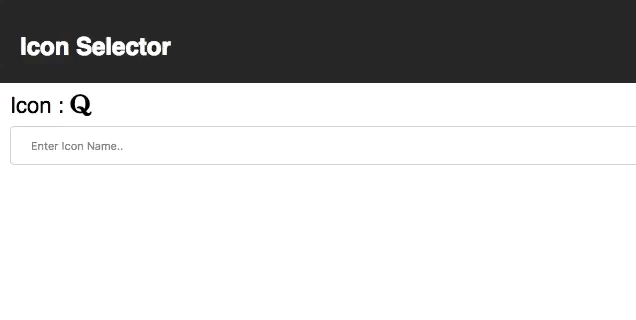

# icon-selector

A utility library that picks icon based upon text entered.(Inspired from this library: https://github.com/jaredpalmer/country-fns )

## Demo




## Install
```
npm install icon-selector --save
```

## Overview

Each icon in icon-selector is represented by an object with the following keys:

- `name`: Icon name.
- `class`: Complete icon class.
- `iconType`: Icon belongs to which library e.g. 'fa' .
- `iconName`: Name of icon as in font-awesome library.

## Quick Example

<!-- Imagine you need to make a "Select Country" input. -->

```jsx
import React, { Component } from 'react';
import { getIcons } from 'icon-selector'

class IconSelector extends Component {
  constructor(props) {
    super(props);
    this.state = {
      icon: "fa fa-address-book",
      value: ""
    }
    this.handleChange = this.handleChange.bind(this);
  }

  handleChange(event) {
    let icon = getIcons(event.target.value) ? getIcons(event.target.value).class : this.state.icon
    this.setState({
        value: event.target.value,
        icon:  icon
    })
  }

  render() {
    return (
        <div className="header">
            <div>
                <label>Icon : </label>
                <i className={this.state.icon} aria-hidden="true"></i>
            </div>
            <input 
                type="text" 
                value={this.state.value} 
                onChange={this.handleChange}
            />
        </div>
    );
  }
}

export default IconSelector;

```


## Author

- Pritesh Poddar


---

MIT LICENSE.
